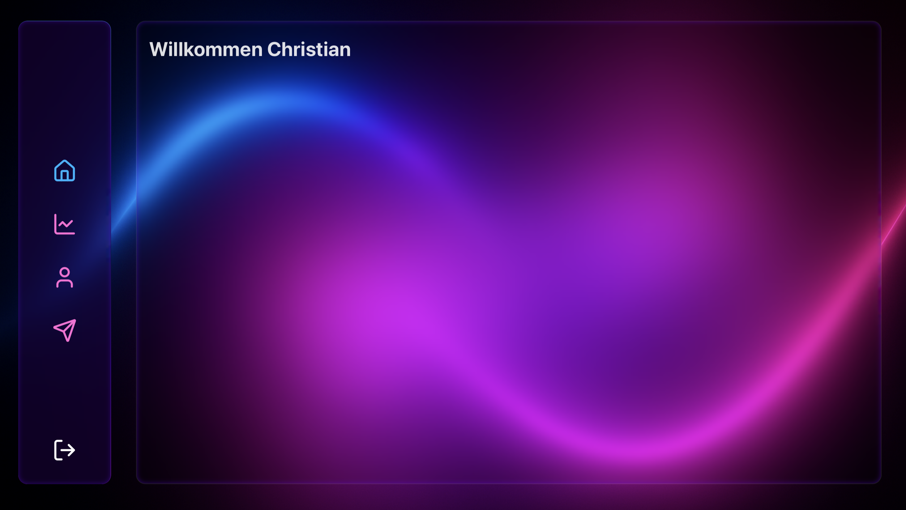
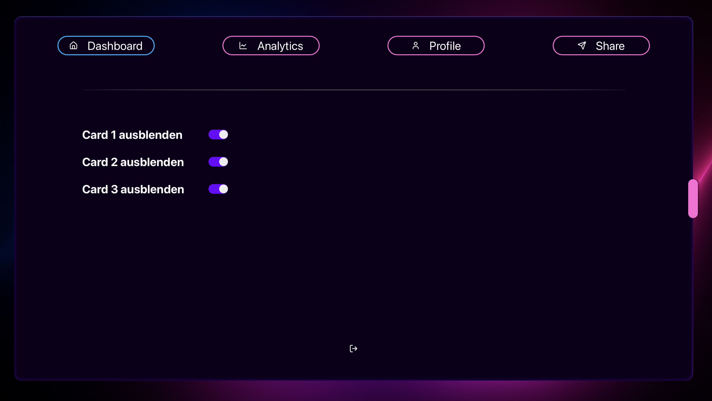

Live Demo: 

[Live Demo](https://react-dashboard-psi-rust.vercel.app)

Screenshots and Idea:

I want to create a neon-liquid glassy Design using [Lucide Icons](https://lucide.dev/icons/) and backdrop blur.

I created a sidebar that opens the Settings menu for each route, using Context and useState, as well as React Router.

Stay tuned! :D